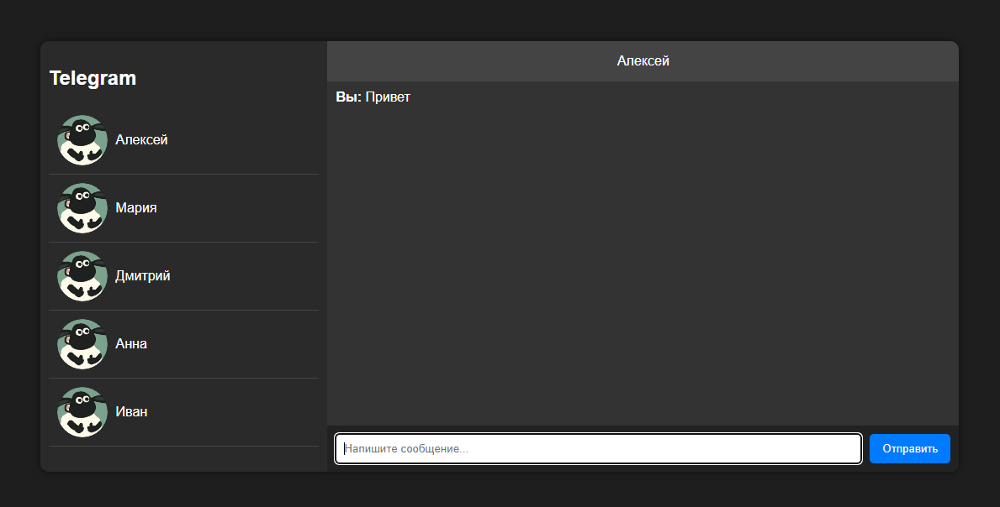

# Messenger UI

<h2>Описание</h2>

Этот проект представляет собой макет мессенджера в темном стиле, вдохновленный Telegram. Он включает:

<ul>
    <li>Список чатов с аватарками пользователей.</li>
    <li>Окно диалога с отображением сообщений.</li>
    <li>Поле ввода сообщений с возможностью отправки по кнопке или клавише Enter.</li>
    <li>Кнопку для добавления вложений (изображений или файлов).</li>
</ul>

<h2>Используемые технологии</h2>
<ul>
    <li>HTML</li>
    <li>CSS</li>
    <li>JavaScript</li>
</ul>

<h2>Как запустить</h2>
<ol>
    <li>Скачайте файлы проекта.</li>
    <li>Откройте <code>index.html</code> в браузере.</li>
    <li>Готово! Можно тестировать интерфейс.</li>
</ol>

<h2>Дополнительные возможности</h2>
<ul>
    <li>Поддержка истории сообщений в пределах одной сессии.</li>
    <li>Динамическое переключение чатов.</li>
</ul>

При необходимости код можно доработать и интегрировать с серверной частью.

  

